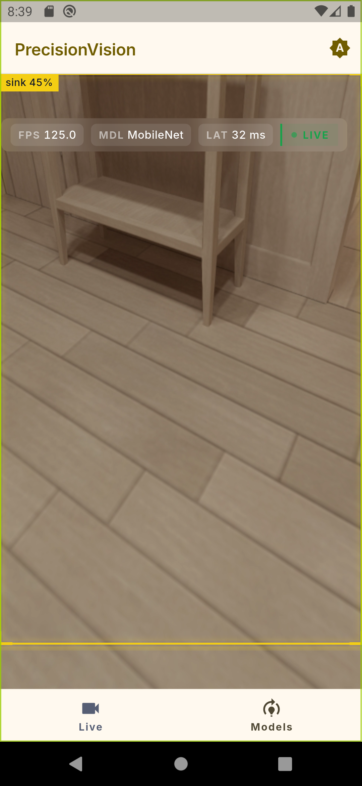
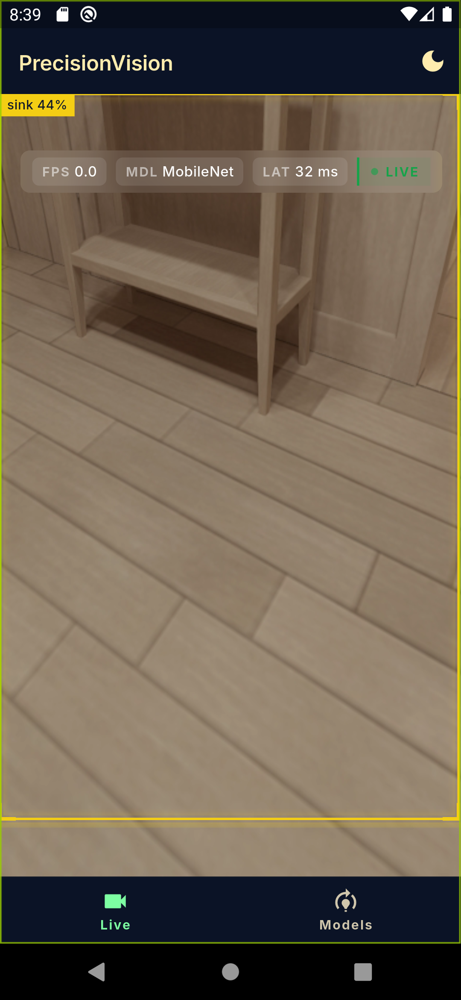
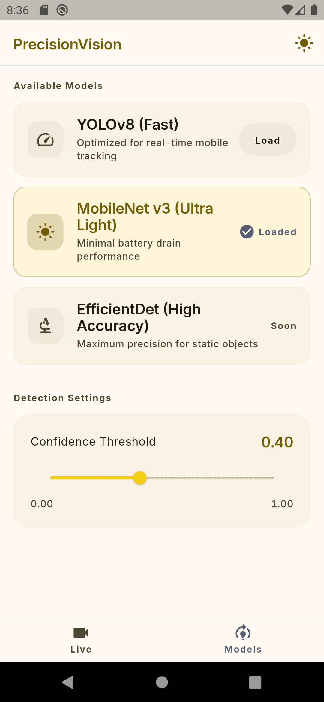
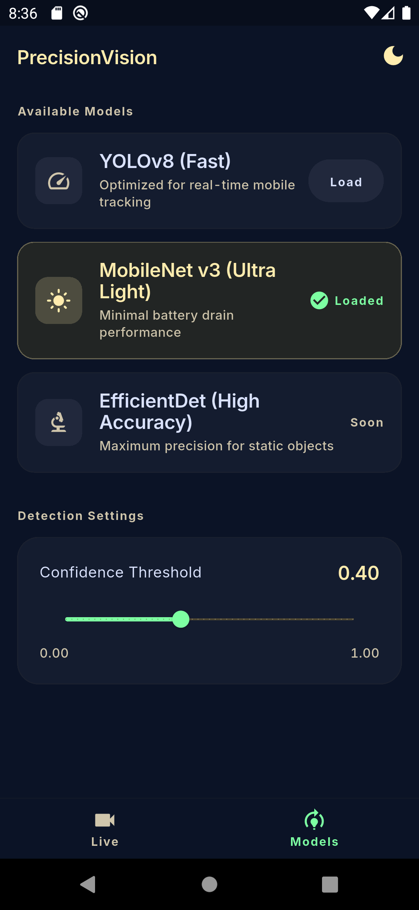

# Precision Vision

**Real-time on-device object detection for mobile.**

Precision Vision brings powerful machine learning object detection directly to your smartphone using optimized TensorFlow Lite models. Experience fast, private, and accurate detection with zero internet dependency.

## ✨ Key Features

- 📷 **Live Camera Detection** — Real-time bounding boxes and labels on the camera feed
- 🧠 **Dual Models** — Switch seamlessly between:
  - **YOLOv8** (Fast & accurate)
  - **MobileNet v3** (Ultra-light, low battery usage)
- 🎚️ **Confidence Control** — Adjust detection sensitivity with a precise slider
- 🎨 **Material You Design** — Full support for light and dark themes with beautiful custom UI
- 🏗️ **Modern Architecture** — Built with Riverpod, GoRouter, and clean separation of concerns

## 📸 Screenshots

### Camera Stream

| Light Theme | Dark Theme |
|-------------|------------|
|  |  |

### Model Settings

| Light Theme | Dark Theme |
|-------------|------------|
|  |  |

## ⬇️ Download APK

A ready-to-install release build is available for Android:

[](https://github.com/yellow-Flickr/precision_vision/releases/latest/download/precision_vision.apk)

**Instructions:**
1. Download the APK from the link above
2. Enable "Install from unknown sources" on your device
3. Install and enjoy real-time object detection!

> The APK (`precision_vision.apk`) is also stored in the `.readme/` folder of this repository.

## 🚀 Getting Started (for Developers)

```bash
# Clone the repo
git clone https://github.com/yellow-Flickr/precision_vision.git
cd precision_vision

# Install dependencies
flutter pub get

# Run on device/emulator
flutter run
```

### Build Release APK

```bash
flutter build apk --release
# Output: build/app/outputs/flutter-apk/app-release.apk
```

## 🛠️ Tech Stack

- **Flutter** 3.11+
- **TensorFlow Lite** (via `flutter_litert`)
- **Camera** plugin for live preview
- **Riverpod** for reactive state management
- **GoRouter** for navigation
- Custom Material 3 theming with blueprint-inspired aesthetics

## 📝 License

This project is licensed under the MIT License - see the [LICENSE](LICENSE) file for details (add one if needed).

---

Made with ❤️ for on-device AI.
